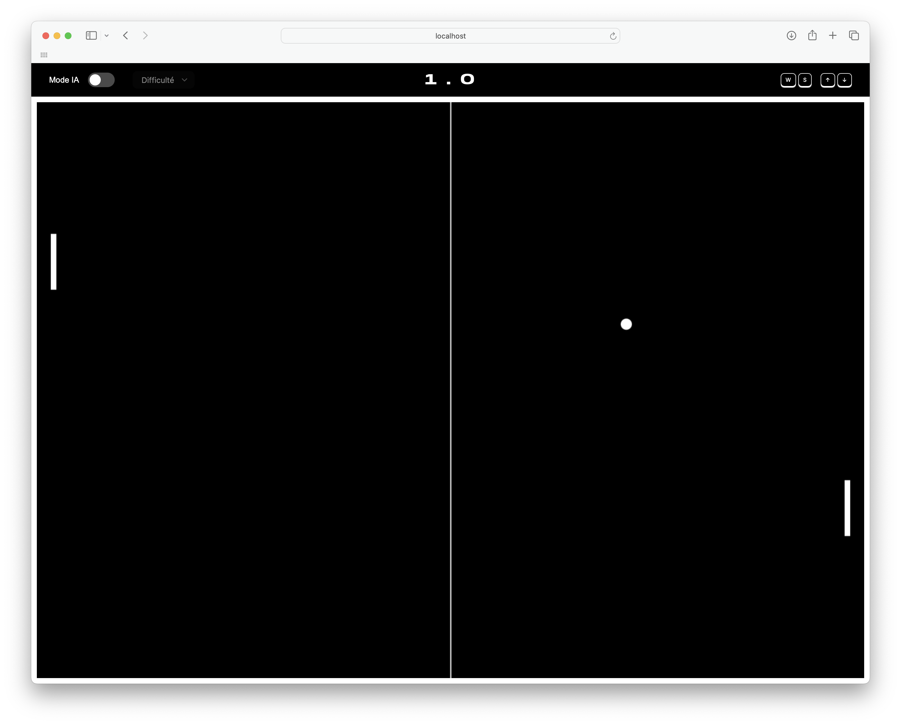
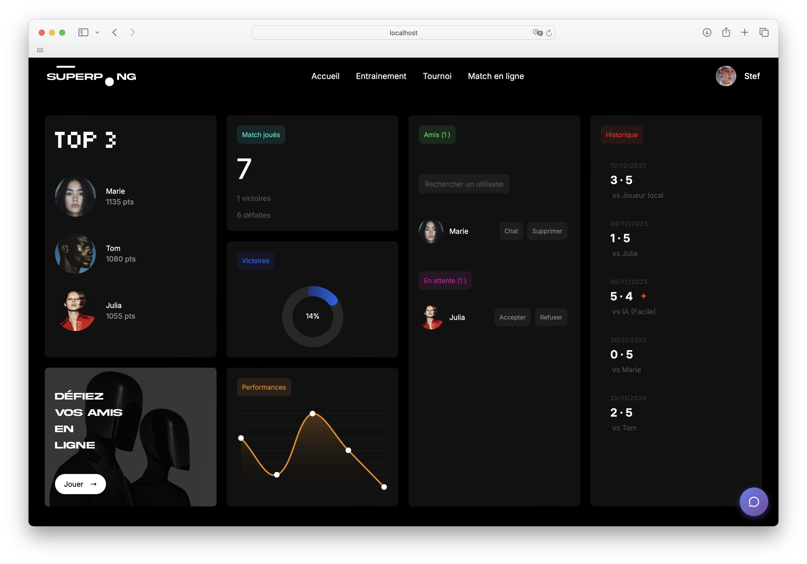

## Transcendence

**Transcendence** est un projet de l’École 42 dont l’objectif est de développer un jeu en ligne. Dans ce cadre, nous avons créé **SuperPong**, une version moderne et en ligne du classique Pong, avec des fonctionnalités pour s’entraîner, jouer et participer à des tournois.

## Fonctionnalités de SuperPong

- Gameplay en plein écran
  - Le jeu s’affiche en fullscreen pour une immersion maximale.

- Entraînement
  - Jouer en tant qu’invité sans compte.
  - Jouer à deux sur le même ordinateur ou contre une IA pour s’entraîner.

- Match en ligne
  - S’inscrire pour accéder au dashboard.
  - Jouer contre d’autres utilisateurs en temps réel.

- Tournois
  - Participer à des tournois organisés automatiquement.
  - Classement des joueurs en fonction des performances.

## Dashboard utilisateur

- Suivi des statistiques personnelles (victoires, défaites, points).
- Gestion du profil.

